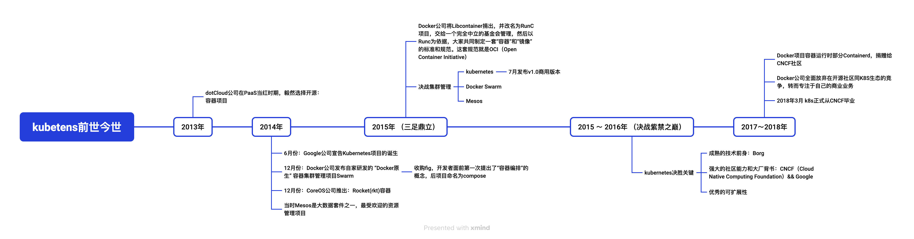

**目录：**
- [1. 前世今生](#1-前世今生)
- [2. docker](#2-docker)
- [3. kubernetes](#3-kubernetes)
  - [3.1. 背景 \&\& 需求](#31-背景--需求)
  - [3.2. 介绍](#32-介绍)
- [4. kubernetes安装](#4-kubernetes安装)
  - [4.1. poc pop 基底](#41-poc-pop-基底)
  - [4.2. 官方部署工具](#42-官方部署工具)
    - [4.2.1. kubeadmin](#421-kubeadmin)
    - [4.2.2. kubekey](#422-kubekey)
- [5. 课后作业](#5-课后作业)

# 1. 前世今生

云计算之前，开发者如需部署管理服务，需要根据需求，进行配置、管理与运维物理机。整体上维护困难，成本高昂，重复劳动，风险随机。在那个时代，应用部署与管理面临着以下诸多问题：
- 硬件、机房等维护成本高。各个团队独立搭建机群、运维机器
- 应用部署、迁移、修复困难。缺少统一的部署发布平台；面对突发情况，缺少自动化工具，排查解决问题依赖人工，低效且成本巨大
- 资源利用率低。物理机的平均资源率不到10%，有的甚至在5%左右，造成了资源的巨大浪费
- 应用隔离性差。多业务混部在一台机器时，会产生干扰。例如：当某一应用资源使用率突然提升，会抢占其他应用的可用资源

为解决上述问题，2006年AWS推出EC2，基于虚拟化技术用户可以在web界面上配置，获取虚拟机资源部署应用。其中虚拟化技术将计算机的各种实体资源如服务器，网络，存储等进行抽象、整合、管理与再分配的一种技术。

虚拟化技术具备如下优势：
- 封装应用技术栈。预安装一些通用软件和库，减少应用对通用软件的依赖
- 提高底层资源的隔离性。虚拟机之间互不干扰
- 动态修改机器、资源配置。
- 资源利用率提升。从平均不到10%提升至15%左右

IaaS平台带来了资源使用率的提升但仍存在局限性相对笨重启动慢，自身消耗大等问题。且**应用程序的部署与打包，仍然需要开发人员各自解决**，仍未高效的完成应用部署与分发。

IaaS平台让用户减少了底层硬件的关注，后续的PaaS平台希望进一步解放用户，让用户**只需关注应用本身**。即帮助用户管理操作系统，持久化层，中间件等。如果说虚拟化让开发、测试、交付能以虚拟机为单位交付，那么后续的PaaS、云原生浪潮将其演进到真正以应用为交付的宏伟计划。

总结：本质上云计算实现的**关键突破就在于资源使用方式的改变**，其最初**解决的核心的问题就是应用的托管**即应用部署与管理问题

# 2. docker

2013 年的后端技术领域，已经太久没有出现过令人兴奋的东西了。曾经被人们寄予厚望的云计算技术，也已经从当初虚无缥缈的概念蜕变成了实实在在的虚拟机和账单。而相比于如日中天的 AWS 和盛极一时的 OpenStack，以 [Cloud Foundry](https://www.redhat.com/zh/topics/application-modernization/what-is-cloud-foundry) 为代表的开源 PaaS 项目，却成为了当时云计算技术中的一股清流。

PaaS 项目被大家接纳的一个主要原因，就是它提供了一种名叫“应用托管”的能力。 在当时，虚拟机和云计算已经是比较普遍的技术和服务了，那时主流用户的普遍用法，就是租一批 AWS 或者 OpenStack 的虚拟机，然后像以前管理物理服务器那样，用脚本或者手工的方式在这些机器上部署应用。

当然，这个部署过程难免会碰到云端虚拟机和本地环境不一致的问题，所以当时的云计算服务，比的就是谁能更好地模拟本地服务器环境，能带来更好的“上云”体验。而 PaaS 开源项目的出现，就是当时解决这个问题的一个最佳方案。

事实上，像 Cloud Foundry 这样的 PaaS 项目，最核心的组件就是一套应用的打包和分发机制。 Cloud Foundry 为每种主流编程语言都定义了一种打包格式，而“cf push”的作用，基本上等同于用户把应用的可执行文件和启动脚本打进一个压缩包内，上传到云上 Cloud Foundry 的存储中。接着，Cloud Foundry 会通过调度器选择一个可以运行这个应用的虚拟机，然后通知这个机器上的 Agent 把应用压缩包下载下来启动。

这时候关键来了，由于需要在一个虚拟机上启动很多个来自不同用户的应用，**Cloud Foundry 会调用操作系统的 Cgroups 和 Namespace 机制为每一个应用单独创建一个称作“沙盒”的隔离环境，然后在“沙盒”中启动这些应用进程。这样，就实现了把多个用户的应用互不干涉地在虚拟机里批量地、自动地运行起来的目的。这，正是 PaaS 项目最核心的能力**。 而这些 Cloud Foundry 用来运行应用的隔离环境，或者说“沙盒”，就是所谓的“容器”。

事实上，Docker 项目确实与 Cloud Foundry 的容器在大部分功能和实现原理上都是一样的，可偏偏就是这剩下的一小部分不一样的功能，成了 Docker 项目接下来“呼风唤雨”的不二法宝。**这个功能，就是 Docker 镜像**。恐怕连 Docker 项目的作者 Solomon Hykes 自己当时都没想到，这个小小的创新，在短短几年内就如此迅速地改变了整个云计算领域的发展历程。

那么，有了 Docker 镜像这个利器，PaaS 里最核心的打包系统一下子就没了用武之地，最让用户抓狂的打包过程也随之消失了。相比之下，在当今的互联网里，Docker 镜像需要的操作系统文件和目录，可谓唾手可得。

你只需要提供一个下载好的操作系统文件与目录，然后使用它制作一个压缩包即可，这个命令就是：
```
$ docker build "我的镜像"
```

一旦镜像制作完成，用户就可以让 Docker 创建一个“沙盒”来解压这个镜像，然后在“沙盒”中运行自己的应用，这个命令就是：
```
$ docker run "我的镜像"
```

所以，Docker 项目给 PaaS 世界带来的“降维打击”，其实是提供了一种非常便利的打包机制。**这种机制直接打包了应用运行所需要的整个操作系统，从而保证了本地环境和云端环境的高度一致，避免了用户通过“试错”来匹配两种不同运行环境之间差异的痛苦过程**。

而对于开发者们来说，在终于体验到了生产力解放所带来的痛快之后，他们自然选择了用脚投票，直接宣告了 Cloud Foundry 时代的结束。

# 3. kubernetes
## 3.1. 背景 && 需求


在过去，多数的应⽤都是⼤型单体应⽤，以单个进程或⼏个进程的⽅式，运⾏于⼏台服务器之上。这些应⽤的发布周期长，⽽且迭代也不频繁。每个发布周期结束前，开发者会把应⽤程序打包后交付给运维团队，运维⼈员再处理部署、监控事宜，并且在硬件发⽣故障时⼿动迁移应⽤。

今天，⼤型单体应⽤正被逐渐分解成⼩的、可独⽴运⾏的组件，我们称之为微服务。微服务彼此之间解耦，所以它们可以被独⽴开发、部署、升级、伸缩。这使得我们可以对每⼀个微服务实现快速迭代，并且迭代的速度可以和市场需求变化的速度保持⼀致。

但是，随着部署组件的增多和数据中⼼的增长，配置、管理并保持系统的正常运⾏变得越来越困难。如果我们想要获得⾜够⾼的资源利⽤率并降低硬件成本，把组件部署在什么地⽅变得越来越难以决策。⼿动做所有的事情，显然不太可⾏。我们需要⼀些⾃动化的措施，包括⾃动调度、配置、监管和故障处理。这正Kubernetes的⽤武之地。

## 3.2. 介绍
**kubernetes是什么？**
Kubernetes是⼀个软件系统，它允许你在其上很容易地部署和管理容器化的应⽤。它依赖于Linux容器的特性来运⾏异构应⽤，⽽⽆须知道这些应⽤的内部详情，也不需要⼿动将这些应⽤部署到每台机器。因为这些应⽤运⾏在容器⾥，它们不会影响运⾏在同⼀台服务器上的其他应⽤，当你是为完全不同的组织机构运⾏应⽤时，这就很关键了。这对于云供应商来说是⾄关重要的，因为它们在追求⾼硬件可⽤率的同时也必须保障所承载应⽤的完全隔离。

**kubernetes核心功能**

整个系统由⼀个主节点和若⼲个⼯作节点组成。开发者把⼀个应⽤列表提交到主节点，Kubernetes会将它们部署到集群的⼯作节点。组件被部署在哪个节点对于开发者和系统管理员来说都不⽤关⼼。

**帮助开发者关注应用本身**
Kubernetes可以被当作集群的⼀个操作系统来看待。不仅简化部署降低运维压力，它也降低了开发者不得不在他们的应⽤⾥实现⼀些和基础设施相关服务的⼼智负担。他们现在依赖于Kubernetes来提供这些服务，包括服务发现、扩容、负载均衡、⾃恢复，甚⾄领导者的选举。应⽤程序开发者因此能集中精⼒实现应⽤本⾝的功能⽽不⽤浪费时间思索怎样集成应⽤与基础设施。

**kubernetes集群架构**

控制面板：
- kubernetes API
- Scheculer
- Controller Manager
- etcd

工作节点：
- kubelet
- Kubernetes Service Proxy

# 4. kubernetes安装
## 4.1. poc pop 基底
https://docs.atrust.sangfor.com/pages/viewpage.action?pageId=292895489

## 4.2. 官方部署工具
1、kubeadmin
2、kubekey

### 4.2.1. kubeadmin
官网github：https://github.com/kubernetes/kubeadm

这个项目的目的，就是要让用户能够通过这样两条指令完成一个 Kubernetes 集群的部署
```
# 创建一个Master节点
$ kubeadm init

# 将一个Node节点加入到当前集群中
$ kubeadm join <Master节点的IP和端口>
```
### 4.2.2. kubekey
官网github：https://github.com/kubesphere/kubekey?tab=readme-ov-file


# 5. 课后作业
1. 阅读kubernetes in action 第一、二章内容
2. 部署得到一个k8s poc集群
3. 什么是云原生？
https://lyremelody.cn/history/timelines/cloudnative-timeline.html
4. dockerfile的编写与部署一个web应用 （:8080 hello world）
5. kubernetes部署的第一个应用

