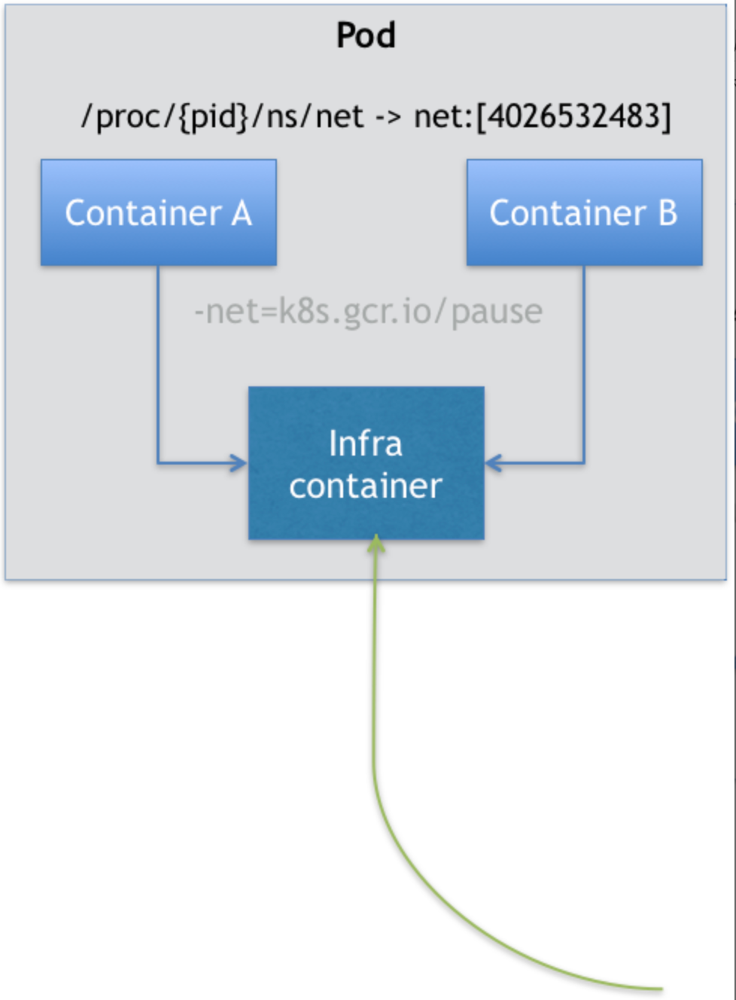
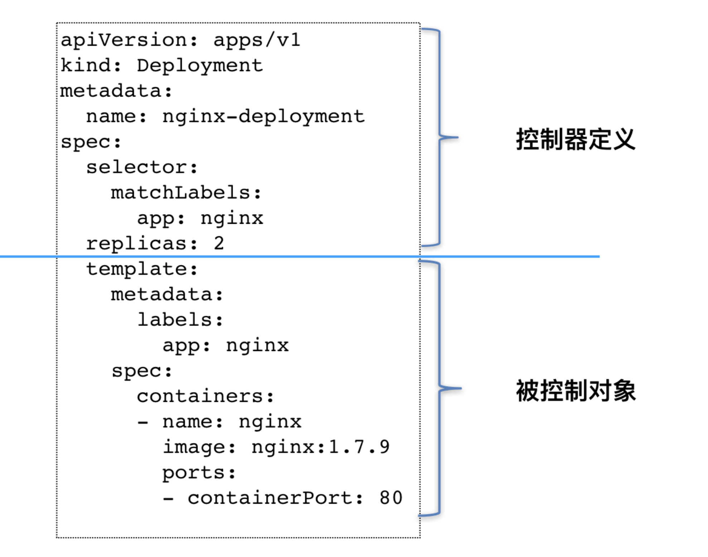
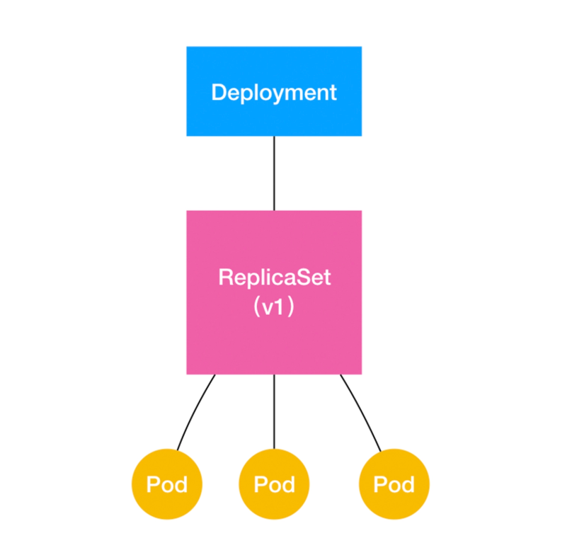
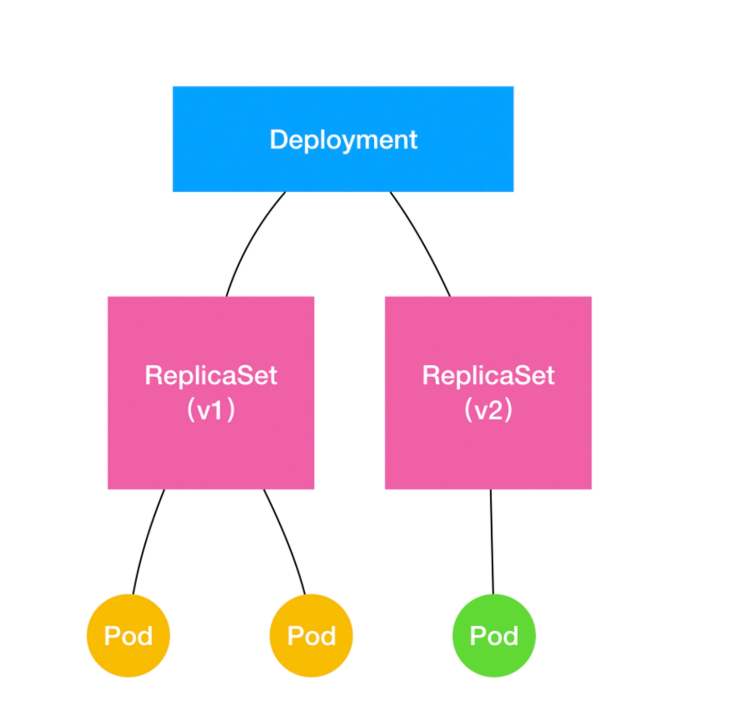

**目录：**
- [1. 容器编排与作业管理](#1-容器编排与作业管理)
- [2. 为什么需要pod？](#2-为什么需要pod)
  - [2.1. 概念1: Pod与容器](#21-概念1-pod与容器)
  - [2.2. Pod API](#22-pod-api)
    - [2.2.1. Pod的内容](#221-pod的内容)
    - [2.2.2. 容器的内容](#222-容器的内容)
    - [2.2.3. 容器健康检查和恢复机制](#223-容器健康检查和恢复机制)
  - [2.3. Pod的声明周期](#23-pod的声明周期)
  - [2.4. 总结](#24-总结)
- [3. 容器编排](#3-容器编排)
- [Deployment](#deployment)
  - [水平伸缩](#水平伸缩)
  - [滚动升级](#滚动升级)
- [StatefulSet](#statefulset)
- [DaemonSet](#daemonset)
- [Job \&\& CronJob](#job--cronjob)


# 1. 容器编排与作业管理

# 2. 为什么需要pod？

## 2.1. 概念1: Pod与容器

既然有了容器为什么k8s还要做一个pod出来？

首先来理解下容器代表了单进程模型？

**为什么容器推荐是单进程模型：**
1. 排障基于容器为维度设计的
2. 自恢复机制也是按照容器为维度设计的

> 容器的“单进程模型”，并不是指容器里只能运行“一个”进程，而是指容器没有管理多个进程的能力。这是因为容器里 PID=1 的进程就是应用本身，其他的进程都是这个 PID=1 进程的子进程。可是，用户编写的应用，并不能够像正常操作系统里的 init 进程或者 systemd 那样拥有进程管理的功能。比如，你的应用是一个 Java Web 程序（PID=1），然后你执行 docker exec 在后台启动了一个 Nginx 进程（PID=3）。可是，当这个 Nginx 进程异常退出的时候，你该怎么知道呢？这个进程退出后的垃圾收集工作，又应该由谁去做呢？

在现实软件设计中，一个应用往往是一组进程，而不是单一进程。多个进程通过套接字，共享内存，文件目录来协同完成任务。k8s意思到这一点用一个对象来描述进程组这个概念，那就是pod。

**既然已经有了容器为什么需要Pod**
1. 应用服务往往是多进程模型，他们往往需要共享Mount、Net Namespace。
2. **Pod是一种容器设计模式**。实际上就是希望，当用户想在一个容器里跑多个功能并不相关的应用时，应该优先考虑它们是不是更应该被描述成一个 Pod 里的多个容器。讲到这里相比大家都听过sidecar模式，例如istio就是对每个pod都注入了一个边车网络代理来管理每个Pod的进出流量来实现微服务网络治理。再比如容器的精细的日志收集，只需在sidecar容器完成将日志采集转发到elasticsearch存储就完成了日志转发的工作。

首先在软件设计上，往往业务会分离为多进程模型，一个进程负责数据面业务，一个进程负责控制面业务，一个进程负责运维监控告警等内容。像这样容器间的紧密协作，我们可以称为“超亲密关系”。**这些具有“超亲密关系”容器的典型特征包括但不限于：互相之间会发生直接的文件交换、使用 localhost 或者 Socket 文件进行本地通信、会发生非常频繁的远程调用、需要共享某些 Linux Namespace（比如，一个容器要加入另一个容器的 Network Namespace）等等**

这也就意味着，并不是所有有“关系”的容器都属于同一个 Pod。比如，PHP 应用容器和 MySQL 虽然会发生访问关系，但并没有必要、也不应该部署在同一台机器上，它们更适合做成两个 Pod。

**什么是Pod？**
1. **首先它是一个逻辑概念**：Kubernetes 真正处理的，还是宿主机操作系统上 Linux 容器的 Namespace 和 Cgroups，而并不存在一个所谓的 Pod 的边界或者隔离环境。具体的说：Pod 里的所有容器，共享的是同一个 Network Namespace，并且可以声明共享同一个 Volume。
2. **Pod内的所有容器是平等关系**，并不存在主从。所以需要在pod启动时就创建Infra容器来管理Net Namespace空间。在 Kubernetes 项目里，Infra 容器一定要占用极少的资源，所以它使用的是一个非常特殊的镜像，叫作：k8s.gcr.io/pause。这个镜像是一个用汇编语言编写的、永远处于“暂停”状态的容器，解压后的大小也只有 100~200 KB 左右。
   - Pod内可通过localhost进行通信
   - 两个容器看到的网络设备是相同的
   - 一个Pod只有一个IP地址
   - 所有网络资源一个Pod一份，被Pod内的所有容器共享
   - Pod的声明周期只跟Infra容器一致，与容器内的A和B无关
3. Pod不是容器是Kubernetes 项目中的最小编排单位

## 2.2. Pod API
### 2.2.1. Pod的内容
**Pod，而不是容器，才是 Kubernetes 项目中的最小编排单位。**
将这个设计落实到 API 对象上，容器（Container）就成了 Pod 属性里的一个普通的字段。那么，一个很自然的问题就是：到底哪些属性属于 Pod 对象，而又有哪些属性属于 Container 呢？

要彻底理解这个问题，你就一定要牢记提到的一个结论：**Pod 扮演的是传统部署环境里“虚拟机”的角色。这样的设计，是为了使用户从传统环境（虚拟机环境）向 Kubernetes（容器环境）的迁移，更加平滑**。

**凡是调度、网络、存储，以及安全相关的属性，基本上是 Pod 级别的。**
这些属性的共同特征是，它们描述的是“机器”这个整体，而不是里面运行的“程序”。比如，配置这个“机器”的网卡（即：Pod 的网络定义），配置这个“机器”的磁盘（即：Pod 的存储定义），配置这个“机器”的防火墙（即：Pod 的安全定义）。更不用说，这台“机器”运行在哪个服务器之上（即：Pod 的调度）。

Pod 里的容器只要声明挂载这个 Volume，就一定可以共享这个 Volume 对应的宿主机目录
   ```
    apiVersion: v1
    kind: Pod
    metadata:
        name: two-containers
    spec:
        restartPolicy: Never
        volumes:
        - name: shared-data
            hostPath:      
            path: /data
        containers:
        - name: nginx-container
            image: nginx
            volumeMounts:
            - name: shared-data
            mountPath: /usr/share/nginx/html
        - name: debian-container
            image: debian
            volumeMounts:
            - name: shared-data
            mountPath: /pod-data
            command: ["/bin/sh"]
            args: ["-c", "echo Hello from the debian container > /pod-data/index.html"]
   ```

NodeSelector：是一个供用户将 Pod 与 Node 进行绑定的字段，用法如下所示：
```
apiVersion: v1
kind: Pod
...
spec:
 nodeSelector:
   disktype: ssd
```

NodeName：一旦 Pod 的这个字段被赋值，Kubernetes 项目就会被认为这个 Pod 已经经过了调度，调度的结果就是赋值的节点名字。所以，这个字段一般由调度器负责设置，但用户也可以设置它来“骗过”调度器，当然这个做法一般是在测试或者调试的时候才会用到。

**凡是跟容器的 Linux Namespace 相关的属性，也一定是 Pod 级别的**。这个原因也很容易理解：Pod 的设计，就是要让它里面的容器尽可能多地共享 Linux Namespace，仅保留必要的隔离和限制能力。这样，Pod 模拟出的效果，就跟虚拟机里程序间的关系非常类似了。

**凡是 Pod 中的容器要共享宿主机的 Namespace，也一定是 Pod 级别的定义**
```
apiVersion: v1
kind: Pod
metadata:
  name: nginx
spec:
  hostNetwork: true
  hostIPC: true
  hostPID: true
  containers:
  - name: nginx
    image: nginx
  - name: shell
    image: busybox
    stdin: true
    tty: true
```

### 2.2.2. 容器的内容
和你分享的 Image（镜像）、Command（启动命令）、workingDir（容器的工作目录）、Ports（容器要开发的端口），以及 volumeMounts（容器要挂载的 Volume）都是构成 Kubernetes 项目中 Container 的主要字段

**首先，是 ImagePullPolicy 字段**。它定义了镜像拉取的策略。而它之所以是一个 Container 级别的属性，是因为容器镜像本来就是 Container 定义中的一部分。

ImagePullPolicy 的值默认是 Always，即每次创建 Pod 都重新拉取一次镜像。另外，当容器的镜像是类似于 nginx 或者 nginx:latest 这样的名字时，ImagePullPolicy 也会被认为 Always。而如果它的值被定义为 Never 或者 IfNotPresent，则意味着 Pod 永远不会主动拉取这个镜像，或者只在宿主机上不存在这个镜像时才拉取。

其次，是 Lifecycle 字段。它定义的是 Container Lifecycle Hooks。顾名思义，Container Lifecycle Hooks 的作用，是在容器状态发生变化时触发一系列“钩子”。我们来看这样一个例子：
```
apiVersion: v1
kind: Pod
metadata:
  name: lifecycle-demo
spec:
  containers:
  - name: lifecycle-demo-container
    image: nginx
    lifecycle:
      postStart:
        exec:
          command: ["/bin/sh", "-c", "echo Hello from the postStart handler > /usr/share/message"]
      preStop:
        exec:
          command: ["/usr/sbin/nginx","-s","quit"]
```
先说 postStart 吧。它指的是，在容器启动后，立刻执行一个指定的操作。需要明确的是，postStart 定义的操作，虽然是在 Docker 容器 ENTRYPOINT 执行之后，但它并不严格保证顺序。也就是说，在 postStart 启动时，ENTRYPOINT 有可能还没有结束。

当然，如果 postStart 执行超时或者错误，Kubernetes 会在该 Pod 的 Events 中报出该容器启动失败的错误信息，导致 Pod 也处于失败的状态。

而类似地，preStop 发生的时机，则是容器被杀死之前（比如，收到了 SIGKILL 信号）。而需要明确的是，preStop 操作的执行，是同步的。所以，它会阻塞当前的容器杀死流程，直到这个 Hook 定义操作完成之后，才允许容器被杀死，这跟 postStart 不一样。

所以，在这个例子中，我们在容器成功启动之后，在 /usr/share/message 里写入了一句“欢迎信息”（即 postStart 定义的操作）。而在这个容器被删除之前，我们则先调用了 nginx 的退出指令（即 preStop 定义的操作），从而实现了容器的“优雅退出”。

### 2.2.3. 容器健康检查和恢复机制
在 Kubernetes 中，你可以为 Pod 里的容器定义一个健康检查“探针”（Probe）。这样，kubelet 就会根据这个 Probe 的返回值决定这个容器的状态，而不是直接以容器镜像是否运行（来自 Docker 返回的信息）作为依据。这种机制，是生产环境中保证应用健康存活的重要手段

```
apiVersion: v1
kind: Pod
metadata:
  labels:
    test: liveness
  name: test-liveness-exec
spec:
  containers:
  - name: liveness
    image: busybox
    args:
    - /bin/sh
    - -c
    - touch /tmp/healthy; sleep 30; rm -rf /tmp/healthy; sleep 600
    livenessProbe:
      exec:
        command:
        - cat
        - /tmp/healthy
      initialDelaySeconds: 5
      periodSeconds: 5
```

demo解释清楚过程。。。

这时我们发现，Pod 并没有进入 Failed 状态，而是保持了 Running 状态。这是为什么呢？其实，如果你注意到 RESTARTS 字段从 0 到 1 的变化，就明白原因了：这个异常的容器已经被 Kubernetes 重启了。在这个过程中，Pod 保持 Running 状态不变。

**这个功能就是 Kubernetes 里的 Pod 恢复机制，也叫 restartPolicy。它是 Pod 的 Spec 部分的一个标准字段（pod.spec.restartPolicy），默认值是 Always，即：任何时候这个容器发生了异常，它一定会被重新创建。**

**此处设置问题？pod重启是在当前节点启动，还是会漂移到其他节点？那什么时候会发生漂移？**

但一定要强调的是，**Pod 的恢复过程，永远都是发生在当前节点上，而不会跑到别的节点上去**。事实上，**一旦一个 Pod 与一个节点（Node）绑定，除非这个绑定发生了变化（pod.spec.node 字段被修改），否则它永远都不会离开这个节点。这也就意味着，如果这个宿主机宕机了，这个 Pod 也不会主动迁移到其他节点上去**。


## 2.3. Pod的声明周期
Pod 生命周期的变化，主要体现在 Pod API 对象的 Status 部分，这是它除了 Metadata 和 Spec 之外的第三个重要字段。其中，pod.status.phase，就是 Pod 的当前状态，它有如下几种可能的情况：

1. Pending。这个状态意味着，Pod 的 YAML 文件已经提交给了 Kubernetes，API 对象已经被创建并保存在 Etcd 当中。但是，这个 Pod 里有些容器因为某种原因而不能被顺利创建。比如，调度不成功。
2. Running。这个状态下，Pod 已经调度成功，跟一个具体的节点绑定。它包含的容器都已经创建成功，并且至少有一个正在运行中。
3. Succeeded。这个状态意味着，Pod 里的所有容器都正常运行完毕，并且已经退出了。这种情况在运行一次性任务时最为常见。
4. Failed。这个状态下，Pod 里至少有一个容器以不正常的状态（非 0 的返回码）退出。这个状态的出现，意味着你得想办法 Debug 这个容器的应用，比如查看 Pod 的 Events 和日志。
5. Unknown。这是一个异常状态，意味着 Pod 的状态不能持续地被 kubelet 汇报给 kube-apiserver，这很有可能是主从节点（Master 和 Kubelet）间的通信出现了问题。

更进一步地，Pod 对象的 Status 字段，还可以再细分出一组 Conditions。这些细分状态的值包括：PodScheduled、Ready、Initialized，以及 Unschedulable。它们主要用于描述造成当前 Status 的具体原因是什么。

比如，Pod 当前的 Status 是 Pending，对应的 Condition 是 Unschedulable，这就意味着它的调度出现了问题。

而其中，Ready 这个细分状态非常值得我们关注：它意味着 Pod 不仅已经正常启动（Running 状态），而且已经可以对外提供服务了。这两者之间（Running 和 Ready）是有区别的，你不妨仔细思考一下。Pod 的这些状态信息，是我们判断应用运行情况的重要标准，尤其是 Pod 进入了非“Running”状态后，你一定要能迅速做出反应，根据它所代表的异常情况开始跟踪和定位，而不是去手忙脚乱地查阅文档。

## 2.4. 总结
总结概念点：
1. Pod，而不是容器，才是 Kubernetes 项目中的最小编排单位
2. 原子调度单位
3. 逻辑概念，不是实际的隔离环境
4. 一组共享了Network Namespace资源的容器
5. 可声明共享同一个Volume


# 3. 容器编排
什么是编排，什么是调度？

在上一篇文章中，我和你详细介绍了 Pod 的用法，讲解了 Pod 这个 API 对象的各个字段。而接下来，我们就一起来看看“编排”这个 Kubernetes 项目最核心的功能吧。

**Pod 这个看似复杂的 API 对象，实际上就是对容器的进一步抽象和封装而已。**

所以，Pod 对象，其实就是容器的升级版。它对容器进行了组合，添加了更多的属性和字段。这就好比给集装箱四面安装了吊环，使得 Kubernetes 这架“吊车”，可以更轻松地操作它。

而 Kubernetes 操作这些“集装箱”的逻辑，都由控制器（Controller）完成。先看Deployment 这个最基本的控制器对象。

```
apiVersion: apps/v1
kind: Deployment
metadata:
  name: nginx-deployment
spec:
  selector:
    matchLabels:
      app: nginx
  replicas: 2
  template:
    metadata:
      labels:
        app: nginx
    spec:
      containers:
      - name: nginx
        image: nginx:1.7.9
        ports:
        - containerPort: 80
```

这就意味着，如果在这个集群中，携带 app=nginx 标签的 Pod 的个数大于 2 的时候，就会有旧的 Pod 被删除；反之，就会有新的 Pod 被创建。

我在前面介绍 Kubernetes 架构的时候，曾经提到过一个叫作 kube-controller-manager 的组件。

实际上，这个组件，就是一系列控制器的集合。我们可以查看一下 Kubernetes 项目的 pkg/controller 目录：

```
$ cd kubernetes/pkg/controller/
$ ls -d */              
deployment/             job/                    podautoscaler/          
cloud/                  disruption/             namespace/              
replicaset/             serviceaccount/         volume/
cronjob/                garbagecollector/       nodelifecycle/          replication/            statefulset/            daemon/
...
```

实际上，这些控制器之所以被统一放在 pkg/controller 目录下，就是因为它们都遵循 Kubernetes 项目中的一个通用编排模式，即：控制循环（control loop）。

```
for {
  实际状态 := 获取集群中对象X的实际状态（Actual State）
  期望状态 := 获取集群中对象X的期望状态（Desired State）
  if 实际状态 == 期望状态{
    什么都不做
  } else {
    执行编排动作，将实际状态调整为期望状态
  }
}
```
**在具体实现中，实际状态往往来自于 Kubernetes 集群本身。**

比如，kubelet 通过心跳汇报的容器状态和节点状态，或者监控系统中保存的应用监控数据，或者控制器主动收集的它自己感兴趣的信息，这些都是常见的实际状态的来源。

**而期望状态，一般来自于用户提交的 YAML 文件。**

比如，Deployment 对象中 Replicas 字段的值。很明显，这些信息往往都保存在 Etcd 中。

这个操作，通常被叫作调谐（Reconcile）。这个调谐的过程，则被称作“Reconcile Loop”（调谐循环）或者“Sync Loop”（同步循环）。

而调谐的最终结果，往往都是对被控制对象的某种写操作。


像 Deployment 这种控制器的设计原理，就是我们前面提到过的，“用一种对象管理另一种对象”的“艺术”。

这个概念非常重要，因为后面我要讲解到的大多数控制器，都会使用 PodTemplate 来统一定义它所要管理的 Pod。更有意思的是，我们还会看到其他类型的对象模板，比如 Volume 的模板。




# Deployment

## 水平伸缩


ReplicasSet：负责控制


## 滚动升级

当修改podtempalte任意字段完成更新动作的时候，通过新增replicaset v2的个数，减少replicaset v1的个数逐步完成替换。

1、如上所示，Deployment 的控制器，实际上控制的是 ReplicaSet 的数目，以及每个 ReplicaSet 的属性。

2、当我们更新一个不存在的镜像时，由于先启动一个v2发现无法启动，此时就会阻塞不再进行。


通过这样的多个 ReplicaSet 对象，Kubernetes 项目就实现了对多个“应用版本”的描述。



Deployment 实际上是一个两层控制器。首先，它通过 ReplicaSet 的个数来描述应用的版本；然后，它再通过 ReplicaSet 的属性（比如 replicas 的值），来保证 Pod 的副本数量。


不过，相信你也能够感受到，Kubernetes 项目对 Deployment 的设计，实际上是代替我们完成了对“应用”的抽象，使得我们可以使用这个 Deployment 对象来描述应用，使用 kubectl rollout 命令控制应用的版本。

可是，在实际使用场景中，应用发布的流程往往千差万别，也可能有很多的定制化需求。比如，我的应用可能有会话黏连（session sticky），这就意味着“滚动更新”的时候，哪个 Pod 能下线，是不能随便选择的。这种场景，光靠 Deployment 自己就很难应对了。

对于这种需求，K8S提供了扩展能力，可以使用“自定义控制器”，来帮我们实现一个功能更加强大的 Deployment Controller。当然，Kubernetes 项目本身，也提供了另外一种抽象方式，帮我们应对其他一些用 Deployment 无法处理的应用编排场景。这个设计，就是对有状态应用的管理。


问题：金色雀发布 && 蓝绿发布


# StatefulSet 
我在结尾处讨论到了 Deployment 实际上并不足以覆盖所有的应用编排问题

造成这个问题的根本原因，在于 Deployment 对应用做了一个简单化假设。它认为，一个应用的所有 Pod，是完全一样的。所以，它们互相之间没有顺序，也无所谓运行在哪台宿主机上。需要的时候，Deployment 就可以通过 Pod 模板创建新的 Pod；不需要的时候，Deployment 就可以“杀掉”任意一个 Pod。

尤其是分布式应用，它的多个实例之间，往往有依赖关系，比如：主从关系、主备关系。

还有就是数据存储类应用，它的多个实例，往往都会在本地磁盘上保存一份数据。而这些实例一旦被杀掉，即便重建出来，实例与数据之间的对应关系也已经丢失，从而导致应用失败。

所以，这种实例之间有不对等关系，以及实例对外部数据有依赖关系的应用，就被称为“有状态应用”（Stateful Application）。

StatefulSet 的设计其实非常容易理解。它把真实世界里的应用状态，抽象为了两种情况：

1. 拓扑状态。这种情况意味着，应用的多个实例之间不是完全对等的关系。这些应用实例，必须按照某些顺序启动，比如应用的主节点 A 要先于从节点 B 启动。而如果你把 A 和 B 两个 Pod 删除掉，它们再次被创建出来时也必须严格按照这个顺序才行。并且，新创建出来的 Pod，必须和原来 Pod 的网络标识一样，这样原先的访问者才能使用同样的方法，访问到这个新 Pod。
2. 存储状态。这种情况意味着，应用的多个实例分别绑定了不同的存储数据。对于这些应用实例来说，Pod A 第一次读取到的数据，和隔了十分钟之后再次读取到的数据，应该是同一份，哪怕在此期间 Pod A 被重新创建过。这种情况最典型的例子，就是一个数据库应用的多个存储实例。

所以，**StatefulSet 的核心功能，就是通过某种方式记录这些状态，然后在 Pod 被重新创建时，能够为新 Pod 恢复这些状态。**


为什么需要Headless Service？因为Pod的IP是不固定的，当发生重启需要重新经过域名解析找到此
服务。

Service 是 Kubernetes 项目中用来将一组 Pod 暴露给外界访问的一种机制。

第一种方式，是以 Service 的 VIP（Virtual IP，即：虚拟 IP）方式

第二种方式，就是以 Service 的 DNS 方式
1. 第一种处理方法，是 Normal Service
2. 而第二种处理方法，正是 Headless Service


通过这种方法，Kubernetes 就成功地将 Pod 的拓扑状态（比如：哪个节点先启动，哪个节点后启动），按照 Pod 的“名字 + 编号”的方式固定了下来。此外，Kubernetes 还为每一个 Pod 提供了一个固定并且唯一的访问入口，即：这个 Pod 对应的 DNS 记录。


1、首先，StatefulSet 的控制器直接管理的是 Pod。这是因为，StatefulSet 里的不同 Pod 实例，不再像 ReplicaSet 中那样都是完全一样的，而是有了细微区别的。比如，每个 Pod 的 hostname、名字等都是不同的、携带了编号的。而 StatefulSet 区分这些实例的方式，就是通过在 Pod 的名字里加上事先约定好的编号。

2、其次，Kubernetes 通过 Headless Service，为这些有编号的 Pod，在 DNS 服务器中生成带有同样编号的 DNS 记录。只要 StatefulSet 能够保证这些 Pod 名字里的编号不变，那么 Service 里类似于 web-0.nginx.default.svc.cluster.local 这样的 DNS 记录也就不会变，而这条记录解析出来的 Pod 的 IP 地址，则会随着后端 Pod 的删除和再创建而自动更新。这当然是 Service 机制本身的能力，不需要 StatefulSet 操心。

3、最后，StatefulSet 还为每一个 Pod 分配并创建一个同样编号的 PVC。这样，Kubernetes 就可以通过 Persistent Volume 机制为这个 PVC 绑定上对应的 PV，从而保证了每一个 Pod 都拥有一个独立的 Volume。

在这种情况下，即使 Pod 被删除，它所对应的 PVC 和 PV 依然会保留下来。所以当这个 Pod 被重新创建出来之后，Kubernetes 会为它找到同样编号的 PVC，挂载这个 PVC 对应的 Volume，从而获取到以前保存在 Volume 里的数据。

```
apiVersion: apps/v1
kind: StatefulSet
metadata:
  name: web
spec:
  serviceName: "nginx"
  replicas: 2
  selector:
    matchLabels:
      app: nginx
  template:
    metadata:
      labels:
        app: nginx
    spec:
      containers:
      - name: nginx
        image: nginx:1.9.1
        ports:
        - containerPort: 80
          name: web
        volumeMounts:
        - name: www
          mountPath: /usr/share/nginx/html
  volumeClaimTemplates:
  - metadata:
      name: www
    spec:
      accessModes:
      - ReadWriteOnce
      resources:
        requests:
          storage: 1Gi
```


# DaemonSet

顾名思义，DaemonSet 的主要作用，是让你在 Kubernetes 集群里，运行一个 Daemon Pod。 所以，这个 Pod 有如下三个特征：

1. 这个 Pod 运行在 Kubernetes 集群里的每一个节点（Node）上；
2. 每个节点上只有一个这样的 Pod 实例；
3. 当有新的节点加入 Kubernetes 集群后，该 Pod 会自动地在新节点上被创建出来；而当旧节点被删除后，它上面的 Pod 也相应地会被回收掉。


这个机制听起来很简单，但 Daemon Pod 的意义确实是非常重要的。

我随便给你列举几个例子：
1. 各种网络插件的 Agent 组件，都必须运行在每一个节点上，用来处理这个节点上的容器网络；
2. 各种存储插件的 Agent 组件，也必须运行在每一个节点上，用来在这个节点上挂载远程存储目录，操作容器的 Volume 目录；
3. 各种监控组件和日志组件，也必须运行在每一个节点上，负责这个节点上的监控信息和日志搜集。

```
apiVersion: apps/v1
kind: DaemonSet
metadata:
  name: fluentd-elasticsearch
  namespace: kube-system
  labels:
    k8s-app: fluentd-logging
spec:
  selector:
    matchLabels:
      name: fluentd-elasticsearch
  template:
    metadata:
      labels:
        name: fluentd-elasticsearch
    spec:
      tolerations:
      - key: node-role.kubernetes.io/master
        effect: NoSchedule
      containers:
      - name: fluentd-elasticsearch
        image: k8s.gcr.io/fluentd-elasticsearch:1.20
        resources:
          limits:
            memory: 200Mi
          requests:
            cpu: 100m
            memory: 200Mi
        volumeMounts:
        - name: varlog
          mountPath: /var/log
        - name: varlibdockercontainers
          mountPath: /var/lib/docker/containers
          readOnly: true
      terminationGracePeriodSeconds: 30
      volumes:
      - name: varlog
        hostPath:
          path: /var/log
      - name: varlibdockercontainers
        hostPath:
          path: /var/lib/docker/containers
```


需要注意的是，Docker 容器里应用的日志，默认会保存在宿主机的 /var/lib/docker/containers/{{. 容器 ID}}/{{. 容器 ID}}-json.log 文件里，所以这个目录正是 fluentd 的搜集目标。

而在正常情况下，被标记了 unschedulable“污点”的 Node，是不会有任何 Pod 被调度上去的（effect: NoSchedule）。可是，DaemonSet 自动地给被管理的 Pod 加上了这个特殊的 Toleration，就使得这些 Pod 可以忽略这个限制，继而保证每个节点上都会被调度一个 Pod。当然，如果这个节点有故障的话，这个 Pod 可能会启动失败，而 DaemonSet 则会始终尝试下去，直到 Pod 启动成功。

这时，你应该可以猜到，我在前面介绍到的 DaemonSet 的“过人之处”，其实就是依靠 Toleration 实现的。


# Job && CronJob

```
apiVersion: batch/v1
kind: Job
metadata:
  name: pi
spec:
  template:
    spec:
      containers:
      - name: pi
        image: resouer/ubuntu-bc 
        command: ["sh", "-c", "echo 'scale=10000; 4*a(1)' | bc -l "]
      restartPolicy: Never
  backoffLimit: 4
```

